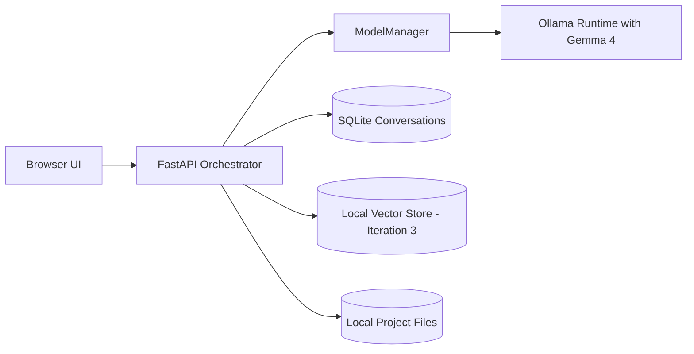

# Architecture Overview

Version: 1.0  
Date: April 6, 2026

## 1. Reference Architecture

## 2. Service Responsibilities

- `UI`: chat UX, settings, model mode toggle, and conversation controls.
- `API Orchestrator`: session handling, prompt assembly, tool routing, model selection, and response streaming.
- `ModelManager`: loads profiles from `config/model_profiles.yaml`, controls model switching, and applies fallback rules.
- `LLM Runtime`: hosts Gemma 4 model and returns generated tokens.
- `Data Layer`: SQLite for metadata/conversation index and vector store for Iteration 3+ retrieval.

## 3. Deployment Modes

## 3.1 Local Docker Mode (Default)

- Compose services: `ui`, `api`, `llm-runtime`, optional `vector-db`.
- Networking restricted to localhost by default.

## 3.2 Kubernetes Mode

- One deployment per service.
- Persistent volume for model cache and state.
- Ingress for browser access on local network.

## 4. Security Boundaries

- Default local-only networking.
- Optional API key for non-localhost access.
- Tool execution isolated behind explicit allowlists.
- No external telemetry enabled by default.

## 5. Scalability Path

- Start single-node laptop deployment.
- Move to Kubernetes without changing API contracts.
- Upgrade runtime from local-only to hybrid local/cluster if needed.

## 6. Operations Baseline

- Health checks for API and model runtime.
- Structured logs for chat, tool, and inference events.
- Basic metrics in Iteration 2, expanded observability in Iteration 4.
